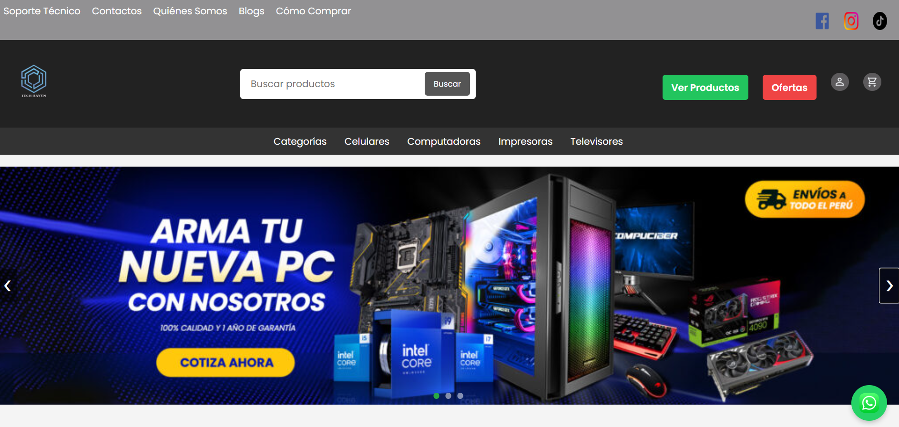

# TECH HAVEN
Bienvenido al repositorio de **TECH HAVEN**, una plataforma de comercio electrónico dedicada a la venta de equipos informáticos, computadoras, laptops, celulares, impresoras y televisores al por mayor y menor, además de ofrecer soporte técnico especializado.

## Sobre el Proyecto

TECH HAVEN es un sitio web estático desarrollado para brindar una experiencia de usuario fluida y moderna a los clientes que buscan lo último en tecnología. Cuenta con un catálogo de productos organizado por categorías, secciones de ofertas, un portal de inicio de sesión y enlaces directos a soporte y contacto (incluyendo integración rápida con WhatsApp).

### Características Principales:
- **Catálogo de Productos**: Exploración por categorías (Celulares, Computadoras, Impresoras, Televisores).
- **Diseño Responsivo**: Interfaz moderna adaptable a distintos dispositivos (HTML5 / CSS3).
- **Integración de Contacto**: Botón flotante de WhatsApp para atención inmediata.
- **Secciones Informativas**: Páginas sobre nosotros, blog, políticas y soporte técnico.
- **Preparado para GitHub Pages**: Rutas configuradas de manera relativa para facilitar su despliegue y visualización directa desde GitHub Pages.

## Tecnologías Usadas

El proyecto está construido principalmente con tecnologías web front-end básicas:
- **HTML5**: Estructura semántica de las páginas web.
- **CSS3**: Estilos, animaciones, sliders y diseño responsive.
- **JavaScript (Vanilla)**: Interacciones dinámicas, carruseles y validaciones.

## Estructura del Proyecto

- `index.html`: Página principal con banners, categorías destacadas y productos populares.
- `productos.html` / `ofertas.html`: Catálogos detallados de los artículos.
- `login.html` / `registro.html`: Páginas de acceso y creación de cuentas de usuario.
- `somos.html` / `soporte.html` / `contacto.html`: Páginas informativas y de asistencia.
- `assets/`: Carpeta que contiene todos los recursos multimedia (imágenes de banners, iconos, productos).
- `*.css`: Hojas de estilo modulares para diferentes vistas del sitio.
- `script.js`: Archivo principal para la lógica y la interactividad del frontend.

## Despliegue

Este proyecto está configurado y alojado de forma gratuita usando **GitHub Pages**. 
Para ver el proyecto en vivo, puedes visitar: 
[**TECH-HAVEN**](https://jonel211.github.io/TECH-HAVEN/)

---
**TECH HAVEN** - *Tu destino tecnológico seguro.*